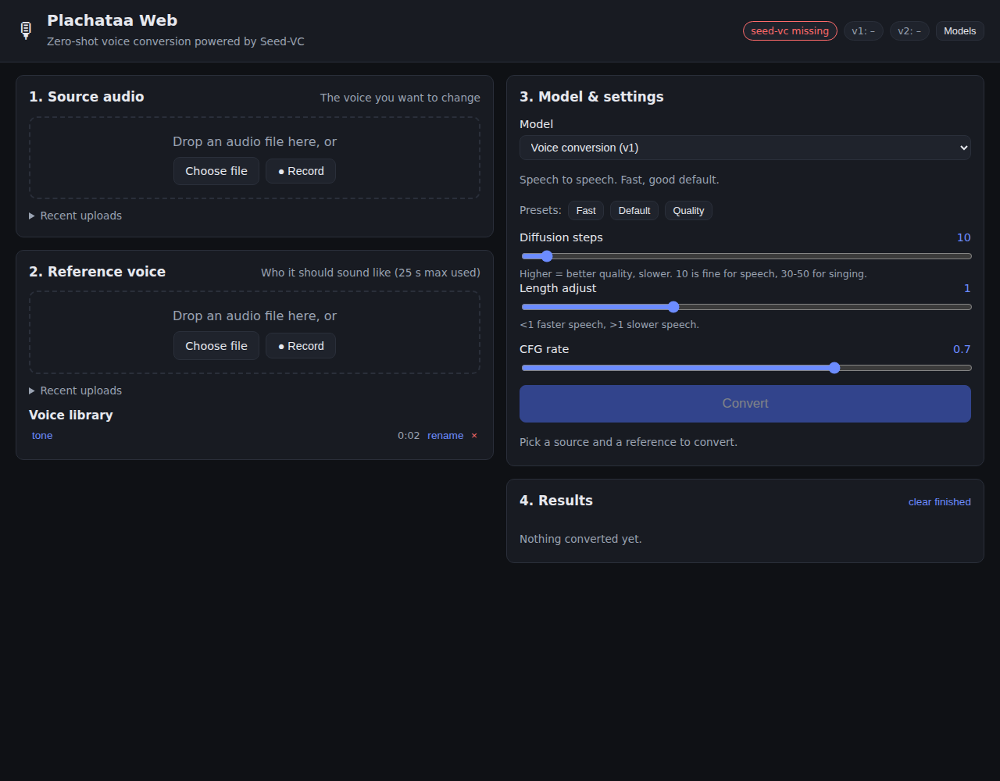

# Plachataa Web

A self-hosted web interface for [Seed-VC](https://github.com/Plachtaa/seed-vc),
the zero-shot voice and singing-voice conversion model, built for a
gaming PC with an NVIDIA RTX card. One installer sets up everything and
registers a service that starts at boot; one script updates it; one
script removes it. Designed to sit behind a reverse proxy on another
machine.

Drop in a recording, pick a reference voice, press Convert. Or start
the real-time mode and speak through the reference voice live.



## Features

- **Voice conversion (v1)**, **singing voice conversion (v1 + F0)** and
  **voice + accent conversion (v2)** from the same page.
- **Real-time voice changer**: microphone in, converted voice out, in
  the browser, using Seed-VC's small real-time model (about half a
  second of delay on an RTX card). Pick any microphone and output device.
- Drag and drop, file picker or **microphone recording** for source and
  reference audio; browser recordings are transcoded server-side.
- **Voice library**: save reference clips under a name and reuse them.
- **Job queue** with live progress, streamed preview while converting,
  cancel, download, and "use as source" to chain conversions.
- Presets (fast / default / quality) and every Seed-VC parameter
  exposed with sensible defaults per model.
- Models load on first use and can be **unloaded to free VRAM** for
  games without stopping the server.
- **NVIDIA driver check**: the installer refuses to pick CUDA on a
  driver too old for the bundled CUDA 12.1 runtime and can update it.
- **Runs at boot** as a systemd service or a Windows startup task,
  restarts on failure, opens the firewall port.
- **Reverse-proxy ready**: relative URLs, sub-path support, trusted
  forwarded headers, optional HTTP basic auth, health endpoint, and
  sample nginx / Caddy configs.
- **Full uninstaller**.
- Everything (code, venv, models, outputs) lives inside this folder.

## Requirements

| | Minimum | Notes |
|---|---|---|
| GPU | NVIDIA RTX 20-series or newer, 6 GB VRAM | 8 GB+ recommended for v2; GTX 10/16-series also work |
| Driver | 528.33 (Windows) / 525.60 (Linux) | needed by CUDA 12.1; the installer checks and can update it |
| OS | Windows 10/11, Ubuntu 22.04+, Fedora, Arch | macOS untested |
| Python | 3.10 or 3.11 | installed by the installer if missing |
| Disk | ~14 GB | ~2.5 GB Python packages + ~8 GB models + outputs |
| Network | first run only | models are downloaded from HuggingFace |

CPU-only works but a 10 s clip takes minutes instead of seconds.

## Install

### Windows

1. Clone or download this repository (Code → Download ZIP → extract).
2. Double-click **`install.bat`**.

The installer uses `winget` to add Python 3.10 and Git if they are
missing, checks the NVIDIA driver, downloads Seed-VC into `vendor/`,
creates `.venv`, installs PyTorch with CUDA 12.1 and registers the
startup task (it asks for administrator rights for that step).

Optional switches (run from a terminal in this folder):

```
install.bat -DownloadModels    pre-fetch all models now (~8 GB)
install.bat -UpdateDriver      install/upgrade the NVIDIA driver if needed
install.bat -ProxyIp 192.168.1.10   trust forwarded headers only from this proxy
install.bat -NoService         do not start at boot (use run.bat instead)
install.bat -Cpu               force the CPU build
install.bat -Yes               never prompt
```

### Linux

```bash
git clone https://github.com/Deimen24/Plachataa_Web.git
cd Plachataa_Web
./install.sh                 # add --download-models, --update-driver,
                             #     --proxy-ip IP, --no-service, --cpu, --yes
```

Run it as your normal user; it asks for `sudo` where needed (running
the whole script with `sudo` is refused, the service must own its
files).

On Debian/Ubuntu the script installs `python3.10`, `git`, `ffmpeg` and
`libsndfile1` with `apt` (adding the deadsnakes PPA when needed). On
Fedora it uses `dnf`, on Arch/CachyOS `pacman`. Distros that only ship
a newer Python (Arch, CachyOS, Fedora 41+) get a self-contained Python
3.11 through [`uv`](https://docs.astral.sh/uv/), installed into your
home directory without touching the system Python. Driver updates use
`ubuntu-drivers`, `akmod-nvidia` or the `nvidia` package respectively
and require a reboot afterwards.

## Run

After installation the server is already running and starts at every
boot. Manage it with:

```
service.bat status | logs | restart | stop | start | uninstall     (Windows)
./service.sh status | logs | restart | stop | start | uninstall    (Linux)
```

The service listens on all interfaces (port 7870) so a reverse proxy on
another machine can reach it; logs go to `data/logs/server.log` (and
the journal on Linux).

To run it by hand instead (for example after `install --no-service`):

```
run.bat            (Windows)
./run.sh           (Linux)
```

This starts on <http://localhost:7870> and opens your browser.
The first conversion with each model family loads it (about 30 s to a
few minutes) and, on the very first run, downloads its checkpoints.

Options are passed straight through:

```
./run.sh --listen          # reachable from your phone / other PCs on the LAN
./run.sh --port 8000
./run.sh --preload v1      # load the v1 models at start
PLACHATAA_NO_BROWSER=1 ./run.sh
```

Stop with Ctrl+C.

## Update

```
update.bat         (Windows)   options: -UpdateDriver -Torch -DownloadModels
./update.sh        (Linux)     options: --update-driver --torch --download-models
```

This pulls the newest version of this repository, moves the vendored
Seed-VC to the revision pinned in `seedvc.lock`, upgrades the Python
dependencies, re-runs the driver / CUDA check and restarts the service.
If the check fails it falls back to the installer to repair the
environment. `--update-driver` installs a newer NVIDIA driver when the
current one is missing or too old for CUDA 12.1.

To check your machine at any time:

```
.venv/bin/python tools/check_env.py --torch        # Linux: GPU, driver, torch
.venv\Scripts\python tools\check_env.py --torch    # Windows
.venv/bin/python tools/smoke_engine.py             # imports seed-vc, builds a model, no download
```

## Uninstall

```
uninstall.bat      (Windows)   options: -KeepData -Purge -RemoveDir -Yes
./uninstall.sh     (Linux)     options: --keep-data --purge --remove-dir --yes
```

Removes the boot service and firewall rule, the Python environment and
the Seed-VC checkout, and asks whether to delete `data/` (saved voices,
outputs, ~8 GB of model cache). `--remove-dir` deletes this folder
too. Python, Git, ffmpeg and the NVIDIA driver are left untouched.

## Reverse proxy on another machine

The service binds `0.0.0.0:7870`. Point your proxy at
`http://<gaming-pc-ip>:7870/`; ready-made configs are in
[`docs/reverse-proxy/`](docs/reverse-proxy/) for **nginx** and
**Caddy**, for both a dedicated hostname and a sub-path.

What the proxy needs:

- **WebSocket upgrade** on `/ws/realtime` (real-time mode).
- **Body size** of at least 200 MB (`client_max_body_size` in nginx),
  matching `PLACHATAA_MAX_UPLOAD_MB`.
- **HTTPS**. Browsers only give microphone access to secure origins,
  so real-time mode needs TLS at the proxy (or `localhost`).
- **Sub-path**: set `PLACHATAA_ROOT_PATH=/voice` in `.env` and make the
  proxy strip the prefix (see the sample configs).

Settings in `.env` on the gaming PC:

- `PLACHATAA_FORWARDED_ALLOW_IPS`: the proxy's IP, so the client IP and
  scheme in the logs are right (`*` trusts any proxy).
- `PLACHATAA_BASIC_AUTH=user:password`: enable if the proxy does not
  authenticate. Real-time mode fetches a short-lived token for its
  WebSocket, so it works behind basic auth too.
- `/api/health` answers without authentication for uptime checks.

## Using the web UI

1. **Source audio**: the recording whose voice you want to change.
   Any length; long files are processed in ~30 s windows.
2. **Reference voice**: a clean clip of the target speaker, 5 to 25 s
   (longer clips are clipped to 25 s). Click *save to library* to keep
   it.
3. **Model**
   - *Voice conversion (v1)*: speech, fastest, good default.
   - *Singing voice conversion (v1 + F0)*: pitch-conditioned 44.1 kHz
     model. Use it for singing; turn on *Auto pitch adjust* for speech
     with a big pitch difference, or shift semitones manually.
   - *Voice + accent conversion (v2)*: best at removing the source
     speaker's traits; can optionally convert style, emotion and
     accent too.
4. **Convert**. Jobs run one at a time; queue as many as you like.

Parameter notes: *Diffusion steps* trades quality for time (10 for
speech, 30 to 50 for singing, 50 to 100 for best quality). *Length
adjust* speeds up or slows down the result. The CFG rates have subtle
effects; the presets cover the useful range.

### Real-time voice changer

1. Pick a reference voice (upload, library or example).
2. In the *Real-time voice changer* card choose your microphone and, if
   you want the converted voice to go into a game or call, a **virtual
   audio cable** (e.g. VB-Cable) as output. Put on headphones.
3. Press *Start*. The first start loads the small real-time model
   (about 2 GB download once).

The card shows the block size, inference time per block and the
algorithmic delay. If inference time approaches the block time the GPU
cannot keep up: pick *Low latency* with fewer diffusion steps or raise
*Block time*. *Right context* is look-ahead: more sounds better and adds
delay one to one. The *Noise gate* mutes blocks below a level so room
noise is not converted.

Real-time mode uses the `seed-uvit-tat-xlsr-tiny` model from Seed-VC's
`real-time-gui.py` with the same streaming and SOLA crossfade logic; it
runs in the browser over a WebSocket instead of a desktop window.
Output device selection needs Chrome or Edge; Firefox plays through the
default device.

## Configuration

Copy `.env.example` to `.env` and uncomment what you need:

| Variable | Default | Purpose |
|---|---|---|
| `PLACHATAA_PORT` | `7870` | HTTP port |
| `PLACHATAA_HOST` | `127.0.0.1` | bind address (`run --listen` uses 0.0.0.0) |
| `PLACHATAA_DEVICE` | `auto` | `cuda`, `cpu` or `mps` |
| `PLACHATAA_DATA_DIR` | `./data` | uploads, outputs, voices, HuggingFace cache |
| `PLACHATAA_SEEDVC_DIR` | `./vendor/seed-vc` | upstream checkout |
| `PLACHATAA_MAX_UPLOAD_MB` | `200` | upload size limit |
| `PLACHATAA_ROOT_PATH` | unset | URL prefix when proxied under a sub-path |
| `PLACHATAA_FORWARDED_ALLOW_IPS` | `127.0.0.1` | proxies whose forwarded headers are trusted |
| `PLACHATAA_BASIC_AUTH` | unset | `user:password` to require HTTP basic auth |
| `PLACHATAA_LOG_FILE` | unset | rotating log file (the service sets `data/logs/server.log`) |
| `HF_ENDPOINT` | unset | e.g. `https://hf-mirror.com` if huggingface.co is blocked |

## HTTP API

The UI talks to a small JSON API (interactive docs at `/api/docs`):

| Method | Path | Purpose |
|---|---|---|
| GET | `/api/health` | liveness, no auth |
| GET | `/api/status` | device, VRAM, loaded models, queue |
| GET | `/api/models` | available models and hints |
| POST | `/api/models/{v1,v2,rt}/load` · `/unload` | manage VRAM |
| POST | `/api/uploads` | multipart upload → `{id, url, duration}` |
| GET/POST/PATCH/DELETE | `/api/voices` | voice library |
| POST | `/api/convert` | `{model, source_id, reference_id|voice_id, params}` → job |
| GET | `/api/jobs` · `/api/jobs/{id}` | job list / state |
| POST | `/api/jobs/{id}/cancel` · `/use-as-source` | |
| GET | `/files/outputs/{name}.wav` | results |
| GET | `/api/realtime/info` · POST `/api/realtime/token` | real-time defaults / WebSocket token |
| WS | `/ws/realtime` | real-time stream: JSON `start`, then float32 PCM blocks both ways |

## Troubleshooting

- **"seed-vc missing" in the header**: run the installer; it clones
  Seed-VC into `vendor/seed-vc`.
- **Driver too old / torch cannot see the GPU**: run
  `update.bat -UpdateDriver` (or `./update.sh --update-driver`), reboot,
  start again. `tools/check_env.py --torch` shows what the server sees.
- **Out of VRAM**: unload the family you are not using (header →
  *Models*), lower diffusion steps, or close the game.
- **Slow first conversion**: model download and load; later ones are
  fast. Pre-download with `install.bat -DownloadModels`.
- **HuggingFace unreachable**: set `HF_ENDPOINT=https://hf-mirror.com`
  in `.env`.
- **Port in use**: set `PLACHATAA_PORT` in `.env` and restart the service.
- **Real-time "GPU too slow"**: lower diffusion steps or raise block
  time; the tiny model runs a 0.26 s block in well under 100 ms on an
  RTX 3060.
- **No microphone prompt**: the page must be served over HTTPS (by the
  proxy) or opened at `http://localhost:7870` on the PC itself.
- **Service will not start**: `service.sh logs` / `service.bat logs`.

## Project layout

See [ARCHITECTURE.md](ARCHITECTURE.md) for how the pieces fit together.

```
install.sh   / install.ps1   / install.bat    one-shot installer
update.sh    / update.ps1    / update.bat     updater (repo, seed-vc, deps, driver)
service.sh   / service.ps1   / service.bat    boot service: install/status/logs/...
uninstall.sh / uninstall.ps1 / uninstall.bat  remove everything
run.sh       / run.ps1       / run.bat        start the server by hand
seedvc.lock                                   pinned upstream revision
requirements-seedvc.txt                       inference deps of seed-vc (no torch)
requirements-web.txt                          FastAPI, uvicorn, bundled ffmpeg
server/                                       API, engine, job queue, real-time
web/                                          static single-page UI + AudioWorklet
tools/                                        check_env, download_models, tests
docs/reverse-proxy/                           nginx and Caddy examples
vendor/seed-vc                            upstream checkout (created by installer)
data/                                     uploads, outputs, voices, model cache
```

## License

GPL-3.0, the same as Seed-VC, whose code this project imports. Model
weights are downloaded from their respective HuggingFace repositories
under their own licenses.
